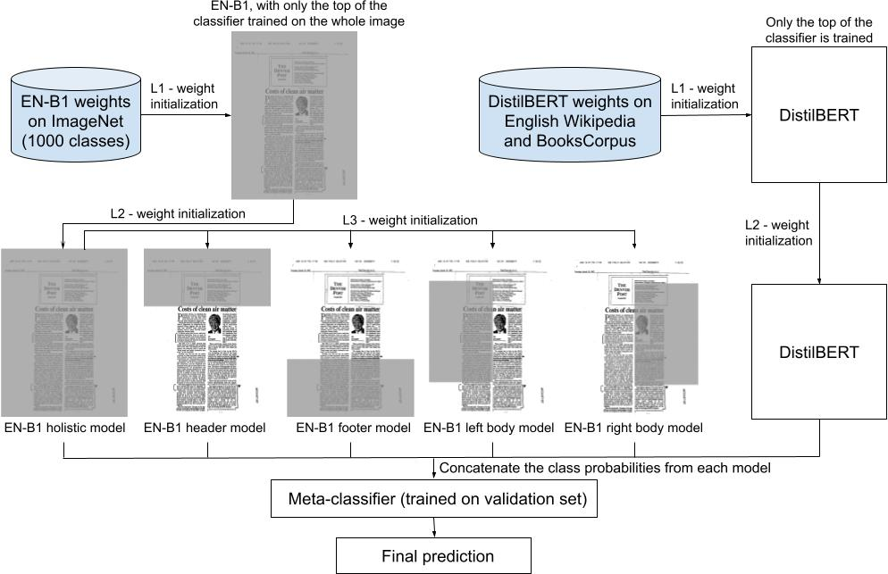

# A Modular Multimodal Model for Document Image Classification
----------------------------------------------------------

Document image classification is the classification of digitized documents. Typically, these documents are either scanned or photographed. One page of such a document is referred to as a document image. Classifying document images is a crucial task since it is an initial step in downstream applications. Most state-of-the-art document image classification models are based on a transformer network, which are pretrained on millions of scanned document images and thus require a huge amount of training resources. Additionally, this and other state-of-the-art document image classification models have well beyond 100 million parameters. In this work, we address both challenges. First, we create a model capable of competing with the current state-of-the-art models without pretraining on millions of scanned document images. Second, we create a model several times smaller than current state-of-the-art models in terms of parameters. The results show that the developed approach achieves an accuracy of **93.70\%** on the RVL-CDIP dataset, and a new state-of-the-art accuracy of **96.25\%** on Tobacco3482.


# Architecture



# Installation

First make sure to have [Anaconda](https://docs.anaconda.com/anaconda/install/) or [miniconda](https://docs.conda.io/en/latest/miniconda.html) installed.
The following installation assumes a Windows OS.
For Linux, use ``pip install https://storage.googleapis.com/tensorflow/linux/gpu/tensorflow_gpu-2.6.2-cp39-cp39-manylinux2010_x86_64.whl`` instead.
```
conda create -n docclassifier python==3.9.12
conda activate docclassifier
pip install https://storage.googleapis.com/tensorflow/windows/gpu/tensorflow_gpu-2.6.2-cp39-cp39-win_amd64.whl
pip install --upgrade "protobuf<=3.20.1"
conda install -c conda-forge tesseract==4.1.1
pip install -r requirements.txt
```

# Usage
## Train

To train the system from scratch, 
first run ``get_data.sh``, followed by ``extract_train_text.py``.

Next, train each model, using ``python train.py -model_name [model_name]``.
For an image only system, use the option ``image_only``.

The default hyperparameters are those, which have achieved the highest test set accuracy on the [RVL-CDIP](https://adamharley.com/rvl-cdip/) dataset.
Type ``python train.py -h`` for more information.

## Finetune

First make sure to have a file for labels in the same format as is used for the [RVL-CDIP](https://adamharley.com/rvl-cdip/) dataset,
i.e. ``path/to/file label``. The paths should be absolute.

When using a multimodal system, first run ``python extract_finetune_text.py`` (run ``python extract_finetune_text.py -h`` for more info).
A labelsfile for a validation set is optional. If the training set size is big enough (defined as more than 10 files per class),
then a validation set is automatically generated. For an image only system, run with the argument ``-image_only``. 

The values for the default hyperparameters are those which have achieved the SOTA of **96.25%** on the Tobacco3482 dataset.
Run ``python finetune.py -h`` to explore the available hyperparameters.

## Test

The system can be tested with ``python train_base.py -file_path [file_path]``.
Note, that if the preprocessing hyperparameters ``image_shape`` and ``max_len`` are changed ``train.py``,
change them as well in ``test.py``.